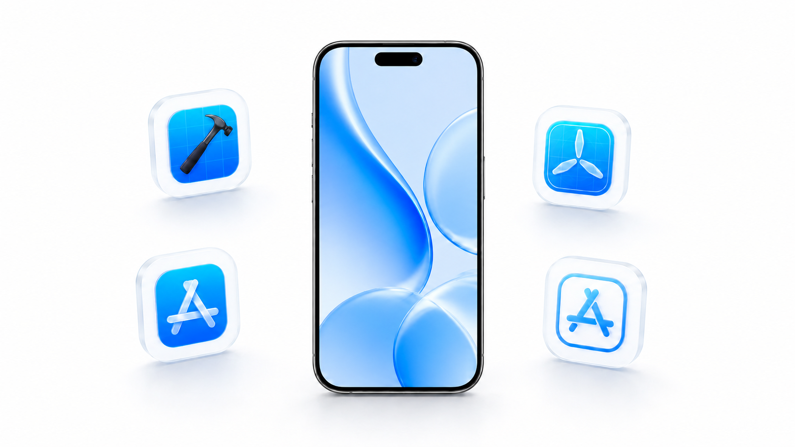

<p align="center"></p>

<h1 align="center">iOS Application Development Skills</h1>

<p align="center">Un pacchetto di skill Codex per release su App Store, ASO, SwiftUI e debugging con Simulator.</p>

<p align="center">[English](README.md) · [简体中文](README_ZH.md) · [繁體中文](README_ZH_TW.md) · [日本語](README_JA.md) · [한국어](README_KO.md)<br>[Español](README_ES.md) · [Français](README_FR.md) · [Deutsch](README_DE.md) · [Português](README_PT.md) · <strong>Italiano</strong><br>[العربية](README_AR.md) · [Русский](README_RU.md) · [Bahasa Indonesia](README_ID.md) · [ไทย](README_TH.md) · [Tiếng Việt](README_VI.md)</p>

## Un plugin per l’intero percorso iOS

`ios-application-development-skills` è un plugin pubblico Codex Git Marketplace che combina operazioni sicure di pubblicazione su App Store, ASO esclusivamente per Apple App Store e tutte le nove skill OpenAI Build iOS Apps.

## Installazione rapida

```bash
codex plugin marketplace add flaqai/ios-application-development-skills --ref main
codex plugin add ios-application-development-skills@flaqai-ios
```

## Cosa puoi fare

| Esigenza | Skill | Risultato |
| --- | --- | --- |
| Esaminare pagina App Store, keyword e screenshot | `$app-store-aso` | `aso-handoff.json` basato su evidenze e approvato campo per campo |
| Creare, tradurre e validare una release | `$ios-appstore-release-manager` | Associazione versione Flutter/Xcode e modulo schema 8 |
| Creare o rifattorizzare SwiftUI | `$swiftui-ui-patterns`, `$swiftui-view-refactor` | Layout stabili e View manutenibili |
| Analizzare crash, prestazioni o memoria | `$ios-debugger-agent`, ETTrace, Memgraph | Diagnosi basata su Simulator |

## Le 11 skill

Oltre alle due skill App Store, il plugin include `$ios-app-intents`, `$ios-debugger-agent`, `$ios-ettrace-performance`, `$ios-memgraph-leaks`, `$ios-simulator-browser`, `$swiftui-liquid-glass`, `$swiftui-performance-audit`, `$swiftui-ui-patterns` e `$swiftui-view-refactor`. Consulta il [README inglese](README.md) per i dettagli completi.

## Limiti di sicurezza della release

Description, Promotional Text, Keywords e What’s New devono essere approvati singolarmente prima che `aso-handoff.json` diventi `approved`. La skill di release mantiene approvazioni per campo, conferma dei conflitti e rilettura dopo il salvataggio; si arresta prima di “Add for Review”.

## Compatibilità e licenza

I flussi Simulator richiedono macOS, Xcode, Node.js/npm/npx e un iOS Simulator disponibile. Leggi la [nota di compatibilità XcodeBuildMCP](plugins/ios-application-development-skills/XCODEBUILDMCP_COMPATIBILITY.md). Questo repository usa la [licenza MIT](LICENSE).

## Guadagna commissioni con il programma di affiliazione Flaq AI

Sviluppatori, costruttori di agenti, recensori, team creativi ed educatori AI possono [aderire al programma di affiliazione Flaq AI](https://flaq.ai/affiliate-program/), creare un link di referral e guadagnare commissioni sugli ordini idonei effettuati dagli utenti segnalati. L’attuale struttura pubblica indica il 20% sul primo ordine a pagamento valido e il 10% sugli ordini a pagamento validi successivi effettuati entro 60 giorni dalla registrazione dell’utente segnalato.

Rimborsi, chargeback, attribuzione, revisione del rischio e regole di policy possono influenzare idoneità e pagamento. Divulga chiaramente il rapporto di affiliazione quando condividi un link di referral e verifica i termini correnti prima di promuoverlo. Leggi la [guida al programma di affiliazione in 15 lingue](https://github.com/flaqai/awesome_seedance_2_5/blob/main/docs/flaq-affiliate-program.md).
