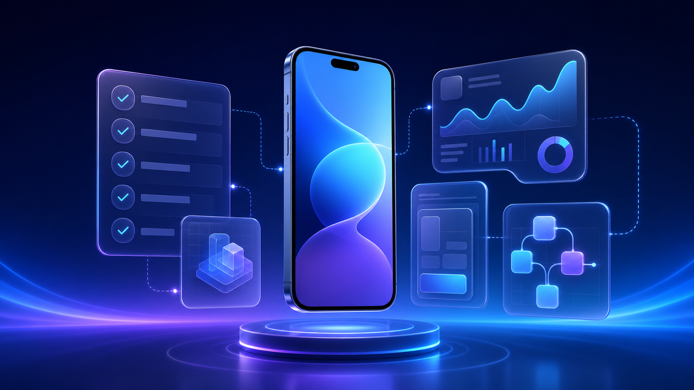

<p align="center"></p>

<h1 align="center">iOS Application Development Skills</h1>

<p align="center">App Store 출시, ASO, SwiftUI, Simulator 디버깅을 하나로 묶은 Codex iOS 스킬 모음입니다.</p>

<p align="center">[English](README.md) · [简体中文](README_ZH.md) · [繁體中文](README_ZH_TW.md) · [日本語](README_JA.md) · <strong>한국어</strong><br>[Español](README_ES.md) · [Français](README_FR.md) · [Deutsch](README_DE.md) · [Português](README_PT.md) · [Italiano](README_IT.md)<br>[العربية](README_AR.md) · [Русский](README_RU.md) · [Bahasa Indonesia](README_ID.md) · [ไทย](README_TH.md) · [Tiếng Việt](README_VI.md)</p>

## 하나의 플러그인으로 iOS 출시까지

`ios-application-development-skills`는 안전한 App Store 출시, Apple App Store 전용 ASO, OpenAI Build iOS Apps의 9개 스킬을 결합한 공개 Codex Git Marketplace 플러그인입니다.

## 빠른 설치

```bash
codex plugin marketplace add flaqai/ios-application-development-skills --ref main
codex plugin add ios-application-development-skills@flaqai-ios
```

## 할 수 있는 일

| 목표 | 스킬 | 결과 |
| --- | --- | --- |
| App Store 페이지, 키워드, 스크린샷 감사 | `$app-store-aso` | 근거 기반의 승인된 `aso-handoff.json` |
| 출시 정보 생성, 번역, 검증 | `$ios-appstore-release-manager` | Flutter/Xcode 버전 연결 및 schema 8 양식 |
| SwiftUI 구현 또는 리팩터링 | `$swiftui-ui-patterns`, `$swiftui-view-refactor` | 안정적인 레이아웃과 유지보수 가능한 View |
| 크래시, 성능, 메모리 문제 조사 | `$ios-debugger-agent`, ETTrace, Memgraph | Simulator 증거 기반 진단 |

## 11개 스킬

두 App Store 스킬 외에 `$ios-app-intents`, `$ios-debugger-agent`, `$ios-ettrace-performance`, `$ios-memgraph-leaks`, `$ios-simulator-browser`, `$swiftui-liquid-glass`, `$swiftui-performance-audit`, `$swiftui-ui-patterns`, `$swiftui-view-refactor`를 포함합니다. 자세한 내용은 [English README](README.md)를 참고하세요.

## 안전한 출시 경계

Description, Promotional Text, Keywords, What’s New는 각각 승인된 뒤에만 `aso-handoff.json`이 `approved`가 됩니다. 출시 스킬은 항목별 승인, 충돌 확인, 저장 후 재확인을 유지하며 “심사용 추가” 전에 멈춥니다.

## 호환성 및 라이선스

Simulator 워크플로에는 macOS, Xcode, Node.js/npm/npx, 사용 가능한 iOS Simulator가 필요합니다. [XcodeBuildMCP 호환성 안내](plugins/ios-application-development-skills/XCODEBUILDMCP_COMPATIBILITY.md)를 확인하세요. 이 저장소는 [MIT License](LICENSE)를 사용합니다.

## Flaq AI Affiliate Program으로 커미션 받기

개발자, 에이전트 빌더, 리뷰어, 크리에이티브 팀, AI 교육자는 [Flaq AI Affiliate Program](https://flaq.ai/affiliate-program/)에 참여해 추천 링크를 만들고 추천 사용자의 적격 주문에서 커미션을 받을 수 있습니다. 현재 공개된 구조는 추천 사용자의 첫 유효 유료 주문에 20%, 가입 후 60일 이내의 후속 유효 유료 주문에 10%를 제공합니다.

환불, 지불 거절, 어트리뷰션, 위험 검토 및 정책 규칙은 자격과 지급에 영향을 줄 수 있습니다. 추천 링크를 공유할 때 제휴 관계를 명확히 공개하고, 홍보 전에 최신 약관을 확인하세요. [15개 언어 Affiliate Program 가이드](https://github.com/flaqai/awesome_seedance_2_5/blob/main/docs/flaq-affiliate-program.md)를 읽어보세요.
